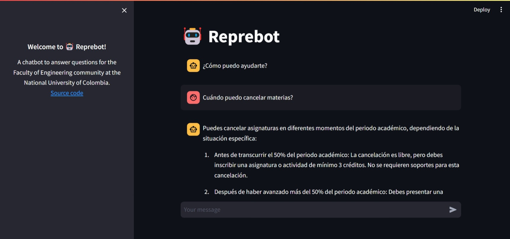
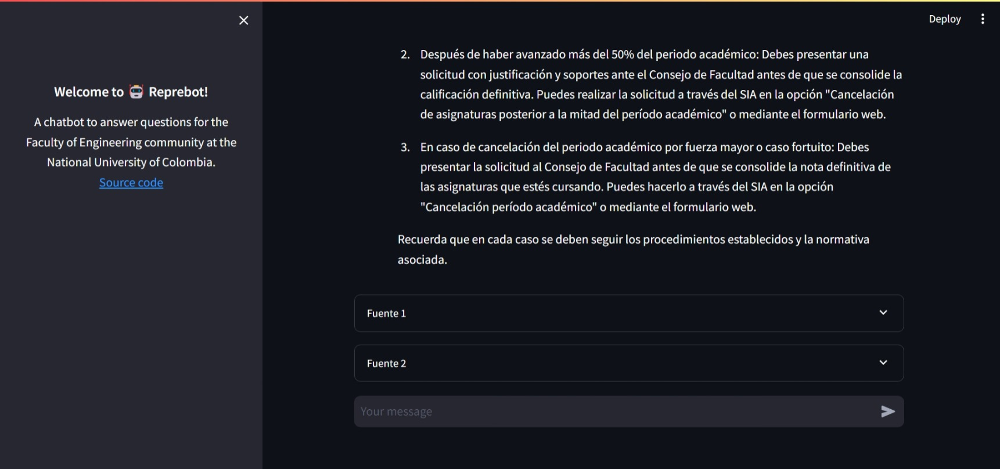
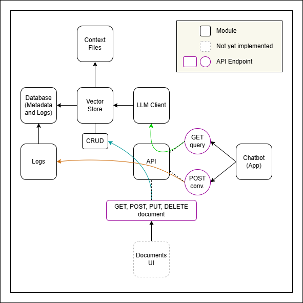

<h1 align="center"> 🤖 Reprebot </h1>

<div align="center">
  <h3>Welcome to <b>Reprebot</b>!</h3>

A chatbot to answer questions for the Faculty of Engineering community at the
National University of Colombia.

[](https://app.codacy.com/gh/Represoft/reprebot/dashboard?utm_source=gh&utm_medium=referral&utm_content=&utm_campaign=Badge_grade)[](https://app.codacy.com/gh/Represoft/reprebot/dashboard?utm_source=gh&utm_medium=referral&utm_content=&utm_campaign=Badge_coverage)

</div>

## Introduction 🚀

**Reprebot** uses a method called Retrieval Augmented Generation (RAG).
This technique involves utilizing a Language Model (LLM) to generate text using
a specific context of information stored in a vector database. In this case,
the context revolves around information related to the academic processes within
the Faculty of Engineering.

## Scope 🔭

**Reprebot** will initially be a microservice containerized and ready to be
incorporated in any architecture. In the future we may implement a user-friendly
interface so that the community can access it in the web at any time. Or it may
be integrated in any of the other systems of the Faculty of Engineering.

## Purpose 🎯

**Reprebot** has the following main objectives:

- **Quick Help:** Provide fast responses to the Faculty of Engineering community
  whenever they need assistance, eliminating the need for emails or visiting
  various departments.

- **Student Support:** Assist students throughout their academic journey by
  offering information on processes, events, and career opportunities.

- **Reduce Workload:** Ease the workload of **Repreisis** and other dependencies
  within the Faculty of Engineering, enabling them to concentrate on more
  impactful tasks and better address student needs.

## Getting Involved 🙌

There are various ways to contribute to **Reprebot**:

- **Join the Team:** Interested in being part of the project? Express your
  interest in joining our team of dedicated volunteers by reaching out to
  **Repreisis** through any of their communication channels.

- **Contribute:** Share your ideas by submitting them to our
  [issues](https://github.com/Represoft/reprebot/issues) backlog.
  Check out our [contributing](CONTRIBUTING.md) guidelines and start
  collaborating.

- **Provide Feedback:** Let us know how Reprebot can be enhanced. Your feedback
  is valuable, and you can reach out to **Repreisis** directly or share your
  ideas in our [issues](https://github.com/Represoft/reprebot/issues) backlog.

- **Spread the Word:** Help us broaden Reprebot's impact by telling your friends
  and peers about its capabilities and benefits within the Faculty of
  Engineering community.

## How to Run it with Docker? 🐋

1. Make sure you have [Docker](https://docs.docker.com/engine/install/) and [Docker Compose](https://docs.docker.com/compose/install/) installed on your machine.
2. Navigate to the root of the project.
3. Create a `.env` file and set the environment variables in it:

    ```sh
    OPENAI_API_KEY=<YOUR_OPENAI_API_KEY>
    API_HOST='api'
    ```

4. Build the Docker images by running:

    ```sh
    docker-compose build
    ```

5. Start the application with:

    ```sh
    docker-compose up
    ```

## How to Get Started Developing? 🏃‍♀️

1. Install [Python](https://www.python.org/downloads/).
2. Install [Git](https://git-scm.com/downloads).
3. Install [pip](https://pip.pypa.io/en/stable/installation/).
4. Install [virtualenv](https://virtualenv.pypa.io/en/latest/installation.html).
5. Create a [GitHub](https://docs.github.com/en/get-started/start-your-journey/creating-an-account-on-github) account if you don't have one.
6. [Fork](https://docs.github.com/en/pull-requests/collaborating-with-pull-requests/working-with-forks/fork-a-repo) the [reprebot](https://github.com/Represoft/reprebot) repository.
7. [Clone](https://docs.github.com/en/repositories/creating-and-managing-repositories/cloning-a-repository) your fork.
8. [Create](https://docs.python.org/3/library/venv.html) a virtual environment
   inside your cloned repository: `python3 -m venv env`.
9. [Activate](https://docs.python.org/3/tutorial/venv.html) the virtual
   environment. On Windows, run `env\Scripts\activate`, and on Linux run
   `source env/bin/activate`.
10. Install the dependencies: `pip install -r requirements.txt`.
11. Run the unit tests: `pytest test/unit/src`.
12. Now your ready to start sending your contributions. See this
    [guide](https://github.com/Represoft/reprebot/blob/main/CONTRIBUTING.md).

> [!NOTE]
>If you have an `OPENAI_API_KEY` and want to use it to try out the application,
you can set it as an environment variable on your computer or add it to a
`.env` file in the root of this project:

```sh
OPENAI_API_KEY=<YOUR_OPENAI_API_KEY>
```

### To quickly check that your `OPENAI_API_KEY` works

1. Navigate to the `src` folder.
2. Run the demo script by executing `py main.py`.

This script asks four demo questions to the GPT model through the LLM Client. You can modify it as needed by adding more questions or choosing different models.

### To run the context builder scripts

1. Navigate to the folder of the script you want to run.
2. Execute the `main.py` script.

For example:

```sh
cd src/context_builder/faculty_secretary_faq
py main.py
```

```sh
cd src/context_builder/faculty_secretary_students_requests
py main.py
```

> [!NOTE]
>Running these scripts will build the context that will be used by **Reprebot**
to give you accurate responses.

### To start the API

1. Navigate to the `api` module folder.
2. Start the web service.

    ```sh
    cd src/api
    uvicorn main:app --reload
    ```

3. You can test the API endpoint at `http://127.0.0.1:8000`.

### To start the application

1. Make sure to start the API as explained before.
2. Open another console window.
3. Navigate to the root of the project.
4. Start the `streamlit` application.

    ```sh
    streamlit run src/app/main.py
    ```

    If you've already set the `API_HOST=api` environment variable on your computer or in the `.env` file, remove it or set its value to `localhost`. The `API_HOST=api` is only needed when running
    the application with docker.

5. You can interact with the application at `http://localhost:8501/`.

Here's an example:




The first time you interact with the application, it automatically sets up the
vector store for you. If you want to set up the vector store before using the
application, navigate to the `src/scripts` folder and run:

```sh
py setup_vector_store.py
```

If you want to reset the vector store at any point, you can run:

```sh
py reset_vector_store.py
```

### To generate the conversations log report

1. Navigate to the `src/scripts` folder.
2. Execute the script by running `py generate_conversations_log.py`

The generated report will be a JSON file located in the `src/scripts` folder.

## Technical Details ⚙️

### Architecture 🏯

The architecture of the system is summarized in the next figure.



The system is made up of a group of modules. Essentially, the chatbot (app) calls the `[GET] query` endpoint of the API. The API then sends these requests to the LLM Client, which sets up the RAG chain using the Vector Store and the LLM model. The Vector Store stores embeddings created from context files, which are supposed to be stored locally on your computer. Therefore, you'll need to run the context builder scripts first to generate them.

After receiving the response from the LLM Client, the app calls the `[POST] conversations` endpoint to log the question and the received response. This endpoint accesses the Log module to store the data. The purpose of this is to analyze the information and gain insights about the performance of the chatbot, check if it's hallucinating, and incorporate new sources of information that may be missing. These logs are stored in an auxiliary SQL database.

The Vector Store also uses the auxiliary SQL database to store metadata about the documents. It includes a submodule called CRUD, which is intended to be used by a UI interface that allows admins to manage the documents. Some API endpoints were already built to manage these documents, but they are not in use yet.

### Programming Languages 🖥️

- **Python**

### Dependencies 🛠️

Reprebot relies on the following dependencies:

- `beautifulsoup4`
- `chromadb`
- `coverage`
- `cryptography`
- `fastapi`
- `Jinja2`
- `langchain`
- `langchain-community`
- `langchain-openai`
- `pytest`
- `python-dotenv`
- `requests`
- `streamlit`
- `transformers`
- `uvicorn`
